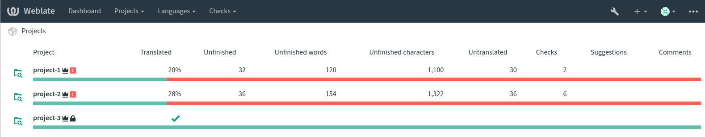
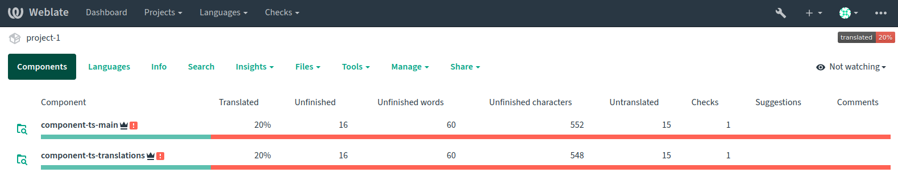

# Weblate operator

[](https://github.com/loktionovam/weblate_operator/actions/workflows/ci.yml)

[](https://codecov.io/gh/loktionovam/weblate_operator)

This is a Kubernetes Operator for the Weblate translation system.

Weblate is a popular localization system and it has a number of objects (projects, components, translations) but there aren't any convenient ways to manage them "as code" and it can be very painful to manage big translation workloads (like hundreds of packages of operation system).

This operator is designed to simplify creating and managing objects in the Weblate.

Supported versions:

* Weblate >= 4.9

## Building and running

### Prerequisites

* docker engine >= 20.10
* helm >= 3.7.1
* helm-docs >= 1.5.0
* make
* python >= 3.10 (used by tests only)
* python3-venv (used by tests only)
* kind >= 0.14.0

### Setup an environment for developing and testing

* Install prerequisites for developing and testing:

  ```shell
  sudo apt-get install python3-venv
  python3 -m venv venv
  source venv/bin/activate
  python -m pip install --upgrade pip

  # Install for tests only
  pip install -r requirements-test.txt

  # Install for developing
  pip install -r requirements-dev.txt
  ```

### Build and test a docker image

* Set up an image name and tag (optional):

    ```shell
    export WEBLATE_OPERATOR_IMAGE_NAME=yourname/weblate_operator
    export WEBLATE_OPERATOR_IMAGE_TAG=0.1.0
    ```

* Build and test the image:

    ```shell
    make create-cluster
    make build-images
    make test-images
    ```

### Run the weblate_operator

#### Installing Weblate and Weblate Operator CRDs

* Install a k8s cluster:

  ```shell
  make create-cluster
  ```

* Install a weblate helm chart release:

  ```shell
  helm install --set siteDomain=weblate.default.svc.cluster.local --set adminUser=admin --set adminPassword=admin weblate weblate/weblate
  ```

* Obtain an API key in the weblate web interface:

  ```shell
  kubectl port-forward services/weblate 8080:80`
  # Get an API key here http://localhost:8080/
  ```

* Install custom resource definitions:

  ```shell
  kubectl apply -f crds
  ```

### Installing Weblate Operator

* Add weblate-operator helm repository:

  ```shell
    helm repo add weblate-operator https://raw.githubusercontent.com/loktionovam/weblate_operator/gh-pages/
    helm repo update
  ```

* Search available weblate-operator helm charts:

  ```shell
    helm search repo --versions weblate-operator

    NAME                             	CHART VERSION	APP VERSION	DESCRIPTION
    weblate-operator/weblate-operator	0.1.2        	v0.1.2     	Weblate operator

  ```

* Create `values.yaml`:

  ```yaml
  ---

  config:
    weblateAPIKey: your-weblate-api-key-here
    weblateAPIUrl: http://weblate.default.svc.cluster.local/api/


  projects:

    - name: project-1
      slug: project-1
      web: http://project-2.example.com
      # it can be dangerous because after deleting related WeblateProject crd the real project in the Weblate will also be deleted
      retentionPolicy: Delete
      components:
      # supported translation file formats by weblate https://docs.weblate.org/en/weblate-4.14/formats.html
      # the first translation component (ts) from 'main' branch
      - name: component-ts-main
        slug: component-ts-main
        retentionPolicy: Delete
        fileFormat: ts
        fileMask: 'ts/*.ts'
        repo: https://github.com/WeblateOrg/test
        branch: main
        newBase: 'ts/cs.ts'
        translations:
          retentionPolicy: Delete
          languageCodes: ['de', 'cs', 'ru', 'es']
      #  the second translation component is equal to above but from 'translations' branch
      - name: component-ts-translations
        slug: component-ts-translations
        retentionPolicy: Delete
        fileFormat: ts
        fileMask: 'ts/*.ts'
        repo: https://github.com/WeblateOrg/test
        branch: translations
        newBase: 'ts/cs.ts'
        translations:
          retentionPolicy: Delete
          languageCodes: ['de', 'cs', 'ru', 'es']

    - name: project-2
      slug: project-2
      web: http://project-2.example.com
      components:
      # a translation component (po) from 'main' branch
      - name: component-po-main
        slug: component-po-main
        fileFormat: po
        fileMask: 'po/*.po'
        repo: https://github.com/WeblateOrg/test
        branch: main
        newBase: 'po/hello.pot'
        translations:
          languageCodes: ['de', 'cs', 'fr', 'es']

    # an empty project without any translations
    - name: project-3
      slug: project-3
      web: http://project-3.example.com
  ```

* Deploy a new helm release:

  ```shell
  helm upgrade --install --values ./values.yaml weblate-operator weblate-operator/weblate-operator
  ```

### How-to check Weblate Operator

* A few minutes later the `project-1`, `project-2`, `project-3` and its components and translations will be created in the Weblate


* and their corresponding crd's statuses will be updated

  ```shell
  kubectl get weblateprojects.loktionovam.com weblate-operator-project-1  -o jsonpath='{.status}' | jq .
  ```

  ```json
  {
    "create_project": {
      "changes_list_url": "http://weblate.default.svc.cluster.local/api/projects/project-1/changes/",
      "components_list_url": "http://weblate.default.svc.cluster.local/api/projects/project-1/components/",
      "enable_hooks": true,
      "id": 16,
      "instructions": "",
      "language_aliases": "",
      "languages_url": "http://weblate.default.svc.cluster.local/api/projects/project-1/languages/",
      "name": "project-1",
      "repository_url": "http://weblate.default.svc.cluster.local/api/projects/project-1/repository/",
      "set_language_team": true,
      "slug": "project-1",
      "source_review": false,
      "statistics_url": "http://weblate.default.svc.cluster.local/api/projects/project-1/statistics/",
      "translation_review": false,
      "url": "http://weblate.default.svc.cluster.local/api/projects/project-1/",
      "web": "http://project-2.example.com",
      "web_url": "http://weblate.default.svc.cluster.local/projects/project-1/"
    },
    "kopf": {
      "progress": {}
    },
    "message": "Project is updated name: project-1, slug: project-1, web: http://project-2.example.com"
  }

  ```

  ```shell
  # also you can check statuses of weblate components
  kubectl get weblatecomponents.loktionovam.com weblate-operator-project-1-component-ts-main -o jsonpath='{.status}' | jq .

  # and translations
  kubectl get weblatetranslations.loktionovam.com weblate-operator-project-1-component-ts-main-cs  -o jsonpath='{.status}' | jq .
  ```

  ```json
  {
  "create_component": {
    "add_message": "Added translation using Weblate ({{ language_name }})\n\n",
    "addon_message": "Update translation files\n\nUpdated by \"{{ addon_name }}\" hook in Weblate.\n\nTranslation: {{ project_name }}/{{ component_name }}\nTranslate-URL: {{ url }}",
    "addons": [],
    "agreement": "",
    "allow_translation_propagation": true,
    "auto_lock_error": true,
    ....
    ....
    # many strings about created component
  },
  "kopf": {
    "progress": {}
  },
  "message": "Component is updated name: component-ts-main, slug: component-ts-main, project_slug: project-1"
  }

  ```

* Check that child entities (components and translations) have [`ownerReferences` in their metadata](https://kubernetes.io/docs/concepts/overview/working-with-objects/owners-dependents/):

  ```shell
  # for weblatecomponent ownerReferences will be WeblateProject custom resource
  kubectl get weblatecomponents.loktionovam.com weblate-operator-project-1-component-ts-main  -o jsonpath='{.metadata.ownerReferences}' | jq .
  ```

  ```json
  [
    {
      "apiVersion": "loktionovam.com/v1alpha1",
      "blockOwnerDeletion": true,
      "controller": true,
      "kind": "WeblateProject",
      "name": "weblate-operator-project-1",
      "uid": "ddd26d37-428d-454e-861f-4e8e616fd377"
    }
  ]

  ```

  ```shell
  # for weblatetranslation ownerReferences will be WeblateComponent custom resource
  kubectl get weblatetranslations.loktionovam.com weblate-operator-project-1-component-ts-main-cs  -o jsonpath='{.metadata.ownerReferences}' | jq .
  ```

  ```json
  [
    {
      "apiVersion": "loktionovam.com/v1alpha1",
      "blockOwnerDeletion": true,
      "controller": true,
      "kind": "WeblateComponent",
      "name": "weblate-operator-project-1-component-ts-main",
      "uid": "cdc70431-4b6d-400c-9a50-d36afcf121fc"
    }
  ]
  ```

## Developing and testing weblate operator

* Install prerequisites [as described here](#setup-an-environment-for-developing-and-testing) and activate python virtual environment
* Install pre-commit hooks

  ```shell
  source venv/bin/activate
  pre-commit install
  pre-commit install-hooks
  ```

* Install Weblate instance and Weblate Operator CRDs [as described here](#installing-weblate-and-weblate-operator-crds)

* Run the operator:

  ```shell
  export WEBLATE_API_URL=http://localhost:8080/api/
  export WEBLATE_API_KEY=weblate-api-key-here
  kopf run  --verbose -n default  weblate_operator/operator.py
  ```

* Install custom resource examples (a project, a component and translations):

  ```shell
  kubectl apply -f examples
  ```

* Format the code and run tests:

  ```shell
  make fmt
  # tests automatically installs CRDs so delete it first
  kubectl delete -f crds
  make test-apps
  ```
